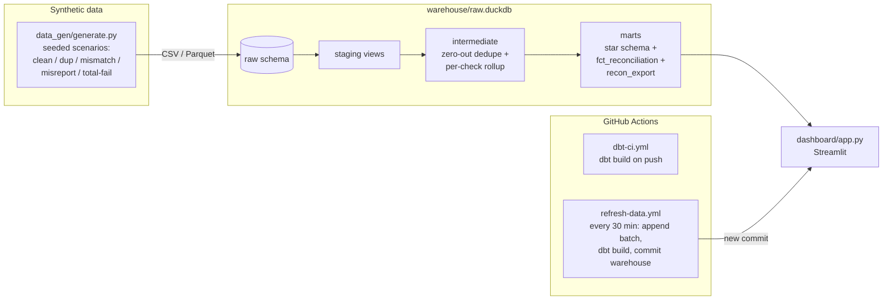

# Remit Reconciliation Engine

**Live demo:** _URL will be added right after the first Streamlit Community Cloud deploy — see [Deploying](#deploying)._

An end-to-end analytics engineering project that reconciles **synthetic**
utility-billing payments against remittances: Python data generator → DuckDB
warehouse → dbt (staging / intermediate / marts, 43 tests) → Streamlit
dashboard, with GitHub Actions running CI and a scheduled "live feed"
refresh that appends a new remit cycle every 30 minutes.

> **All data is 100% synthetic and self-generated.** No real company names,
> account numbers, customer data, or proprietary business rules. The project
> generalizes a common remittance-reconciliation pattern in generic terms.

## What it does

Per account and remit cycle, four checks:

| # | Check | Rule |
|---|-------|------|
| 1 | Payment | `SUM(Payment) = Remit` |
| 2 | Charge | `SUM(UtilityCharge) = CustCharge` |
| 3 | Adjustment | `SUM(AdjustmentAmt) = Adjustments` |
| 4 | R-C | `(CustCharge + Adjustments) − Remit = reported "R-C" difference` |

**Zero-out dedupe:** when duplicate dollar amounts inflate a detail column,
the engine zeroes the duplicate occurrences (it never alters or deletes a
real amount) until the column ties to its summary target. Zeroing is applied
only while it moves the sum *toward* the target — including duplicated
credits, which deflate a column instead of inflating it. Anything still
unmatched afterwards is flagged for **manual review**. Every zero-out gets a
SOX-style adjustment note requiring manager approval.

**Status:** `GREEN` if all four checks pass, `RED` otherwise, with per-check
pass/fail, notes, and a color-coded export view.

## Architecture



dbt lineage: `raw` sources → 8 staging views → 4 intermediate models (three
`zero_out_dedupe` macro instantiations + a summary-driven rollup so accounts
with zero detail rows are still evaluated) → 6 marts (`dim_account`, three
fact tables carrying original *and* adjusted amounts with `is_duplicate` /
`is_zeroed` flags, `fct_reconciliation`, `recon_export`).

## Data quality

43 dbt tests run on every build and in CI:

- `unique` / `not_null` on every primary key, staging through marts
- `relationships` from each fact table to `dim_account`
- `accepted_values` on status (`GREEN`/`RED`)
- **Singular test — zero-out tolerance:** every check marked passed must tie
  out within $0.01 after dedupe, and every account still unmatched after
  zeroing must carry the manual-review flag
- **Singular test — zero-out safety:** only duplicate occurrences may be
  zeroed, and an adjusted amount must be exactly `0` or the untouched
  original — real amounts are never altered

The generator seeds every path on purpose (verified verdicts from the base
batch — the engine never sees these labels):

| Seeded scenario | Engine verdict |
|---|---|
| clean (67) | GREEN |
| duplicate payment / charge / adjustment rows (29) | GREEN via zero-out, SOX note pending approval |
| real underpayment, summary drift, seeded total failure (16) | RED + manual review |
| phantom R-C difference on export (4) | RED (R-C check) |
| disclosed known difference (3) | GREEN, difference surfaced as outstanding |
| duplicate **plus** real shortfall (1) | RED + manual review — engine refuses to zero a duplicate that cannot produce a match |

## Run it locally

```bash
python -m venv .venv && . .venv/bin/activate   # Windows: .venv\Scripts\activate
pip install -r requirements.txt
python data_gen/generate.py            # base build (batch B0001)
python warehouse/load_raw.py           # load DuckDB raw schema
cd dbt_project && dbt build --profiles-dir . && cd ..
streamlit run dashboard/app.py
```

Simulate the live feed locally: `python orchestration/refresh.py` (appends
one cycle and rebuilds; run it again for another).

## Deploying

Streamlit Community Cloud (free): share.streamlit.io → New app → pick this
repo, branch `main`, main file `dashboard/app.py`. The scheduled
`refresh-data.yml` workflow commits a refreshed warehouse every 30 minutes
and Streamlit redeploys automatically, so the public dashboard behaves like
a live-feed tool rather than a static snapshot.

## What's live today vs. next steps

**Live today (everything in this repo actually runs):**
- Synthetic generator with 11 seeded scenario types, CSV + Parquet output
- DuckDB warehouse, dbt project with 18 models / 43 passing tests
- Zero-out dedupe as a reusable, tested dbt macro
- Streamlit dashboard with match rate, trend, color-coded export,
  manual-review and SOX approval queues, account drill-down
- CI (`dbt build` on push) and the 30-minute scheduled refresh

**Documented next steps (not built here):**
- Swap the dbt profile target to Snowflake/BigQuery for a cloud-warehouse
  deployment — models are warehouse-agnostic SQL (see
  `dbt_project/profiles.yml`)
- Replace the committed `.duckdb` file with object storage (committing a
  binary every 30 minutes grows git history; fine for a demo, wrong for prod)
- Incremental dbt models instead of full rebuilds once volume warrants it
- Alerting (e.g. Slack webhook) when match rate drops below a threshold
