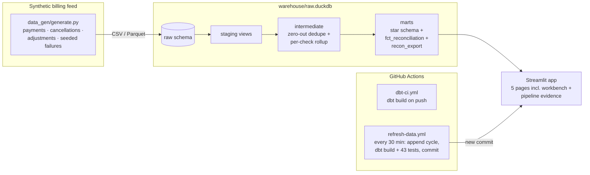

# Remit Reconciliation Engine

[](https://github.com/jelendu/remit-reconciliation-engine/actions/workflows/dbt-ci.yml)
[](https://github.com/jelendu/remit-reconciliation-engine/actions/workflows/refresh-data.yml)

**Live demo: [remit-reconciliation-engine.streamlit.app](https://remit-reconciliation-engine.streamlit.app/)** — no login, no install. A GitHub Action appends a new synthetic remit cycle **every 30 minutes**, reruns the full dbt build + tests, and the app redeploys — it is a live pipeline, not a static snapshot.

Payments come in. The books say something else. This engine finds every mismatch — automatically.

A production-style rebuild of a real reconciliation workflow: a utility-billing remittance feed that **changes every cycle** (payments post, services get cancelled, adjustments land — originally SQL Server extracts reconciled in Excel), rebuilt as a tested SQL pipeline that repairs what it can, proves what it did, and routes what it can't fix to a human.

> **All data is 100% synthetic and self-generated.** No real company names, account
> numbers, customer data, or proprietary business rules — the project generalizes
> a common remittance-reconciliation pattern in generic terms.

## The app (start here)

| Page | What you'll see |
|---|---|
| 🧭 **The problem** | The 60-second story: why this exists, how the engine works, live stats, one-click guided demos |
| 🔬 **Reconciliation workbench** | Pick any account — or jump to "duplicate repaired" / "manual review" / "misreported export" — and watch all four checks run with the actual math, before/after zero-out |
| 📊 **Operations dashboard** | Cycle KPIs with deltas, match-rate trend, failed-checks breakdown, exception queues, CSV export |
| 🛠️ **Pipeline & tests** | The dbt lineage DAG and all 43 test results **rendered from dbt's own artifacts**, plus the live refresh commit feed |
| 👋 **About this build** | What each part demonstrates, honest limits, next steps |

## The reconciliation logic

Per account and remit cycle, four checks:

| # | Check | Rule |
|---|-------|------|
| 1 | Payment | `SUM(Payment) = Remit` |
| 2 | Charge | `SUM(UtilityCharge) = CustCharge` |
| 3 | Adjustment | `SUM(AdjustmentAmt) = Adjustments` |
| 4 | R-C | `(CustCharge + Adjustments) − Remit = reported "R-C" difference` |

**Zero-out dedupe:** when duplicate dollar amounts inflate a detail column, the
engine zeroes the duplicate occurrences (it never alters or deletes a real
amount) until the column ties to its summary target — including duplicated
credits, which deflate a column instead of inflating it. Anything still
unmatched goes to **manual review**, and every repair carries a SOX-style
adjustment note requiring manager approval. The rule is implemented once, as a
parameterized dbt macro ([`zero_out_dedupe`](dbt_project/macros/zero_out_dedupe.sql)),
instantiated three times, and **enforced by tests** — not by a promise.

## Architecture



The original workflow's source was SQL Server; here a deterministic generator
emulates the moving billing system so every recon path is demonstrable — clean
passes, duplicate-inflated columns (fixable), real shortfalls (unfixable),
summary drift, misreported exports, disclosed known differences.

## Engineering evidence

- **18 dbt models** across staging → intermediate → marts (star schema)
- **43 dbt tests** on every build: `unique`/`not_null` on every key,
  `relationships` to `dim_account`, `accepted_values` on status, and two
  singular tests that encode the business rule itself:
  - [`assert_zero_out_reconciles_or_flags`](dbt_project/tests/assert_zero_out_reconciles_or_flags.sql) —
    passed checks must tie out within $0.01; unmatched accounts must be flagged
  - [`assert_only_duplicates_zeroed`](dbt_project/tests/assert_only_duplicates_zeroed.sql) —
    only duplicates may be zeroed; amounts are `0` or untouched, never edited
- **CI** runs the full build on every push; the **scheduled refresh** re-tests
  every 30 minutes on fresh data before committing
- The app's Pipeline page renders the lineage DAG and test results **from
  dbt's own `manifest.json` / `run_results.json`** — republished each run

## Repo tour

```
data_gen/         synthetic generator (11 seeded scenario types) + CSV/Parquet output
warehouse/        DuckDB loader + the bundled warehouse the app reads
dbt_project/      models (staging/intermediate/marts), macros, tests, artifacts
orchestration/    one-shot refresh entrypoint used locally and by Actions
dashboard/        Streamlit app: app.py + ui.py + views/ (5 pages)
.github/workflows dbt CI + 30-minute scheduled refresh
```

## Run it locally

```bash
python -m venv .venv && . .venv/bin/activate   # Windows: .venv\Scripts\activate
pip install -r requirements.txt
python orchestration/refresh.py --base         # generate → load → dbt build (61 items)
streamlit run dashboard/app.py
```

Simulate the live feed: `python orchestration/refresh.py` appends one cycle
and rebuilds; run it again for another.

## What's live today vs. next steps

**Live (everything in this repo actually runs and is deployed):** generator,
DuckDB warehouse, dbt models + tests, zero-out macro, the 5-page app, CI, the
30-minute scheduled refresh, the public deployment.

**Documented next steps (deliberately not built):**
- Swap the dbt target to Snowflake/BigQuery (models are warehouse-agnostic —
  see [`profiles.yml`](dbt_project/profiles.yml))
- Object storage instead of committing the `.duckdb` (git history growth)
- Incremental models once volume warrants it
- Match-rate threshold alerting (e.g. Slack webhook)
- Persisted approvals (the workbench approval button is a UI demo)
